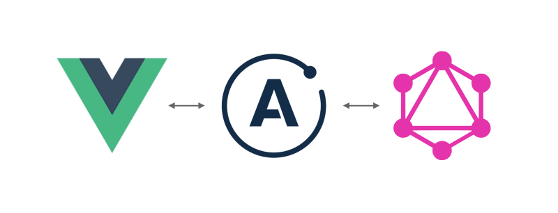

[

]((https://sanofi-iadc.github.io/whispr/))

# Introduction

](https://github.com/semantic-release/semantic-release)

Whispr is an open source event, comment and alert processing hub created by Sanofi IADC. We created it to meet our need for a centralised comment and alerting service which could be easily integrated into our tech stack.

Using Whispr you can easily add an event based pub sub system to your ecosystem. We’ve implemented a messaging service for users to communicate between our apps, and a business process status pub/sub alerting solution - any system can send an alert to Whispr, and susbscribing applications and users are automatically notified to display the alert and take action.

## To read more, go to our [documentation](https://sanofi-iadc.github.io/whispr/) site.

# Main features

* GraphQL and REST API for whisp creation
* Whisp classification through severity types
* Filtering using any of the base elements of a whisp
* Tag management system for whisp classification
* Subscriptions through GraphQL with Websockets (more subscription types coming up very soon in our roadmap)

# Whispr consists of the following main elements

* Whispr core providing an whisp pub/sub system - publishing systems can register whisps in Whispr core when they need to share the status with. Whispr core can be used by any application capable of communicating with GraphQL or REST APIs
* A front end component library for fast implementation of some common use cases within your Vue.js or React based web application.

# Tech stack

## Whispr core
* [Nest.js](https://docs.nestjs.com/)
* GraphQL (out of the box with Nest.js)
* Webbsockets for GraphQL pub sub
* Simple REST API

## Whispr UI

* [Vue.js](https://vuejs.org/)
* [Vuetify](https://vuetifyjs.com/)

# Sponsorship

We’re not looking for sponsorship, please check out the pages of our favourite open source projects which make up our standard tech stack.

## NestJS

## Vue.js

## Vue-apollo

## Vuetify

