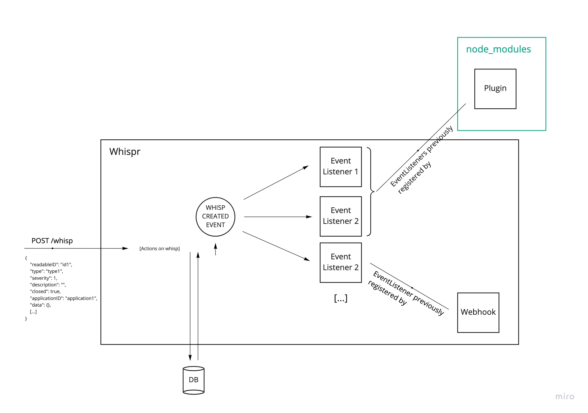

# Event system

Whispr provides an internal event system that allows event listeners
to execute various actions when an event is triggered.

## Event

An event contains two fields: a name and a payload.

Example:
```javascript
{
  name: "WHISP_CREATED",
  payload: WhispEntity
}
```

**Event list:** All the events are registered in the EventNames enum in the `event.entity.ts` file.

## Event Listeners

[Webhooks](../webhooks) and [plugins](../plugins) can register event listeners. 

## Schema


