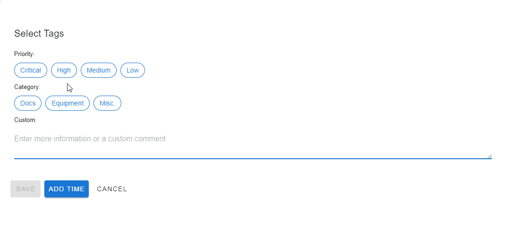

# Introduction

Whispr is an open source event, comment and alert processing hub created by Sanofi IADC. We created it to meet our need for a centralised comment and alerting service which could be easily integrated into our tech stack.

In Whispr each event object is called a whisp. A whisp is classified with a severity level from info to critical, can have tags to further classify it, and has a generic data object which stores the detail of the whisp. As an example, a comment within an application could be a whisp of severity level info, with the comment text in the data object.

Using Whispr we’ve implemented a messaging service for users to communicate between our apps, and a business process status pub/sub alerting solution - any system can send an alert to Whispr, and susbscribing applications and users are automatically notified to display the alert and take action.

## Main features

* GraphQL and REST API for whisp creation
* Whisp classification through severity types
* Filtering using any of the base elements of a whisp
* Tag management system for whisp classification
* Subscriptions through GraphQL with Websockets (more subscription types coming up very soon in our roadmap)

## Example use cases for Whispr 

* Equipment status sharing (alerting) from IoT equipment
* Lightweight comment feed (messaging) solutions
* Machine learning on a central hub of data to identify data trends (common root causes for alerts, alert patterns)

### Whispr in action

*Demonstration of using whispr as a comment system. Each comment is a whisp with severity info, and tags are also defined as a separate object type in whispr. All user interface components you see are available for use in the whispr UI library.*

## Key components
Whispr consists of the following main elements:

* **Whispr core:** providing an whisp pub/sub system - publishing systems can register whisps in Whispr core when they need to share the status with. Whispr core can be used by any application capable of communicating with GraphQL or REST APIs
* **Whispr UI:** A front end component library for fast implementation of some common use cases within your Vue.js or React based web application.

## Roadmap

* We have big plans for Whispr, here are a few of the key items
Plugin system
* Advanced filtering
* Whisp schema registration and validation